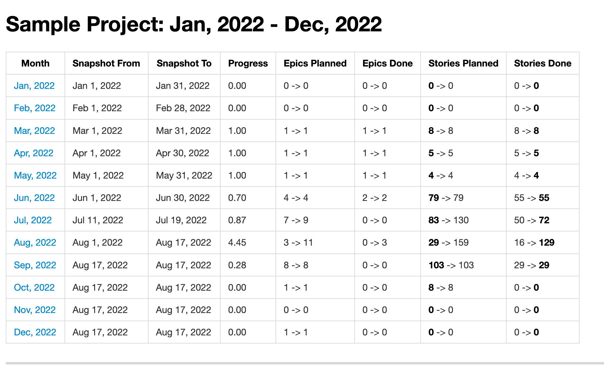

Roadsnap
========

This simple CLI tool allows to cache **JIRA epics** by a project name and then generate a monthly progress report based on historic data.



### Usage

Prerequisites
* [Docker](https://docker.com)
* Make

```sh
# Build your application
$ make build

# Configure your application
$ make config

# Check the reference
$ make help
```
